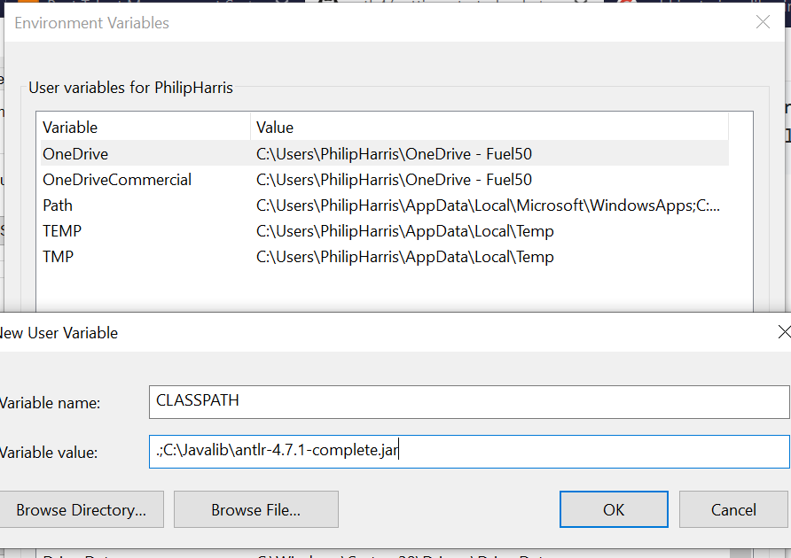

## Add antlr to Classpath

`mkdir -p /c/JavaLib`
`cp lib/*.jar /c/JavaLib`

Using System Properties dialog > Environment variables > Create or append to CLASSPATH variable

Also add javac to your %Path% environment variable

What I've learned so far:
- grammer goes into a g4 file
- antlr (either through gradle or through the antlr bat) will convert the g4 into java/javascript/python/etc code that will parse and lex programs
- Don't know whether the 'test' commands will allow me to manually put in code for the program to parse/lex

The gradle task 'processResources' is not picking up any files.
I need to add in some test files for my parser to parse

TODO: look into this https://www.baeldung.com/java-antlr