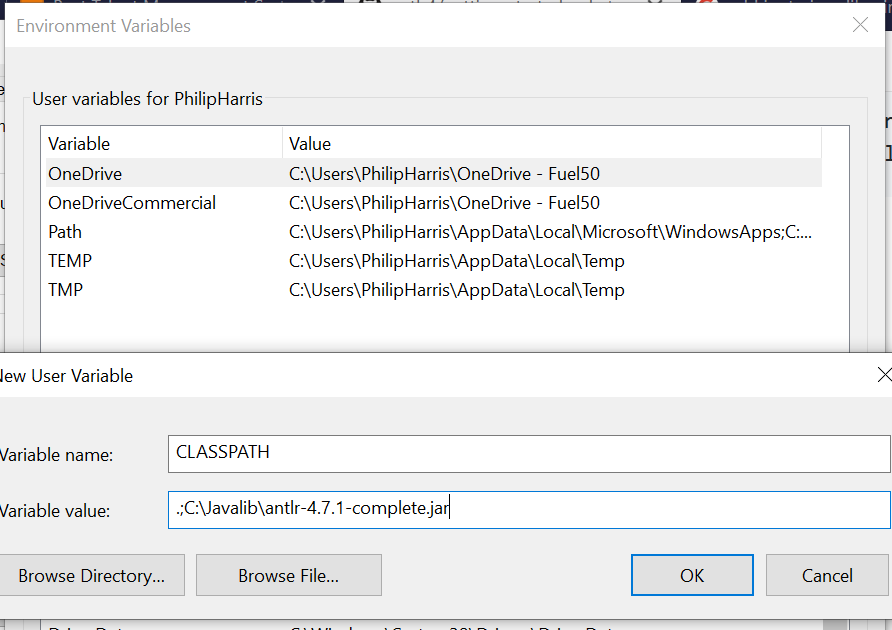

The angularjs-upgrader attempts to 

- parse AngularJs 1.3 files from `src/main/resources/` and 
- outputs the Angular 8 in the `upgradedAngular/` folder

# Instructions

1. Install Java 8 JDK
2. `cd angularjs-upgrader/ && ./gradlew generateGrammarSource`
3. Copy your AngularJs into `src/main/resources/`
4. `java -cp ./build/libs/angularjs-upgrader.jar ...? org.angularjsupgrader.Main`
5. Upgraded files should be in `angularjs-upgrader/upgradedAngular`

# Limitations

- It will not generate DTO structures for json objects fetched from your server

TODO:

- Upgrade function contents
- Convert AngularJs Promises into RxJs Subscriptions
- Get the program to accept the AngularJs-input path from the cmd line, rather than being hard-coded to the resources folder
- Upgrade html templates
- Extract out `ng-controller="..."` from templates

## Antlr (Optional)
Antlr is useful for debugging issues with the grammar `*.g4` files. 
Download the Antlr jars from https://www.antlr.org/download.html

`mkdir -p /c/JavaLib`
`cp lib/*.jar /c/JavaLib`

Using System Properties dialog > Environment variables > Create or append to CLASSPATH variable

Also add javac to your %Path% environment variable

